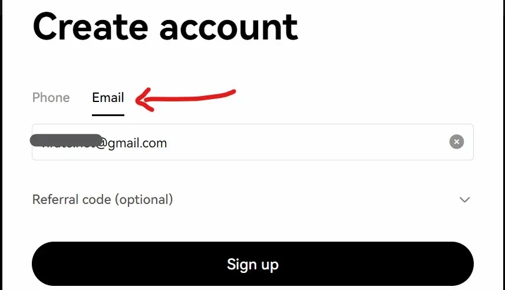
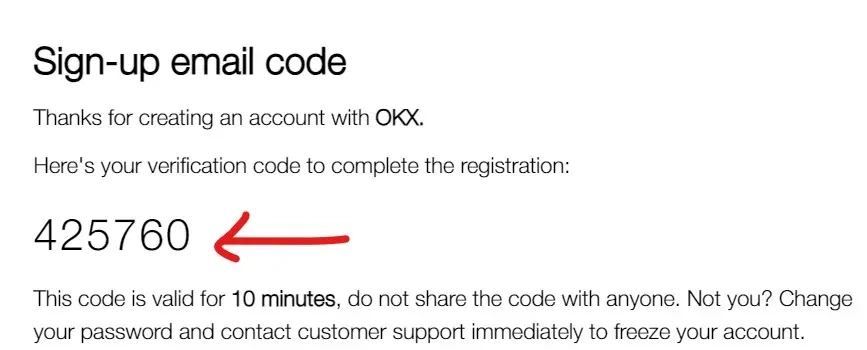
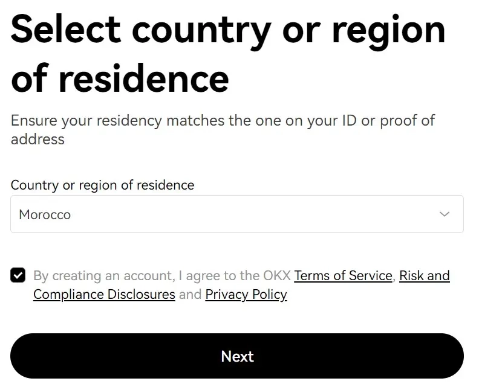
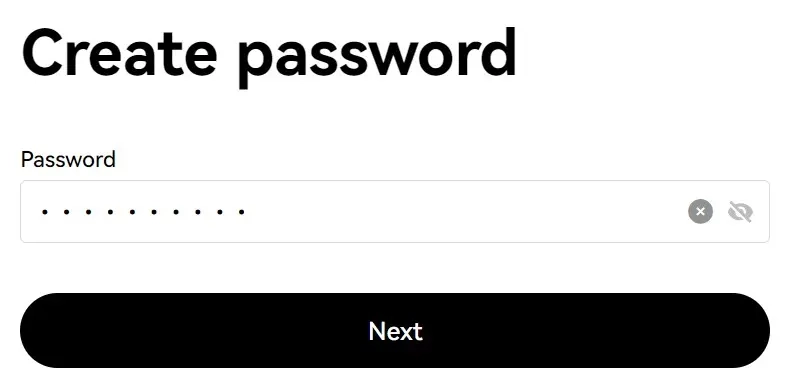
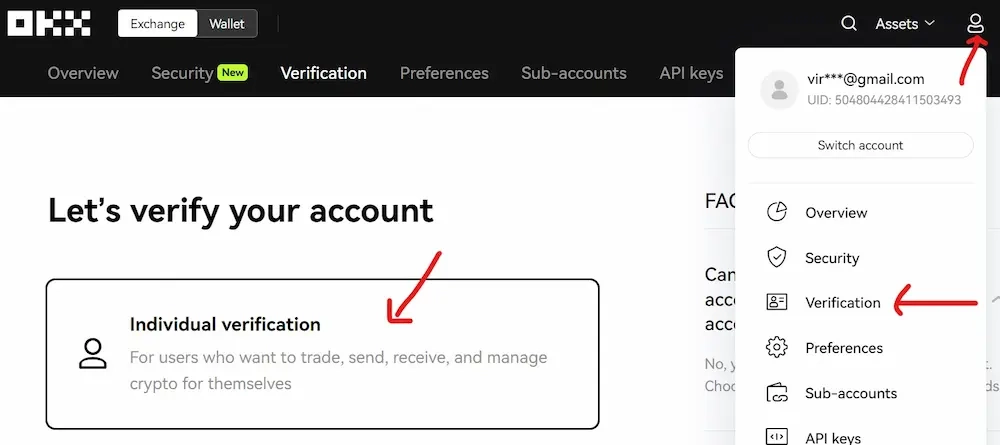
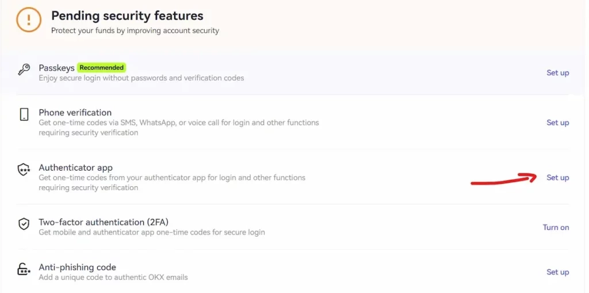

# OKX交易平台完整指南：从注册到进阶交易

---

如果你正在寻找一个历史悠久、流动性强大、支持多样化交易产品的加密货币平台，OKX可能就是你的答案。这个成立于2014年的老牌交易所，日交易量超过180亿美元，在全球拥有2200万用户。无论你是新手还是专业交易者，这篇指南会帮你快速掌握OKX的核心功能——从开户到提现，从现货到衍生品，一次性搞清楚。

---

## OKX是什么？一个不装腔作势的老平台

OKX的前身叫OKEx，2014年就开始做了。2022年改名叫OKX，但本质没变——它就是个啥都能交易的综合性平台。

现在OKX支持320多种加密货币和代币，覆盖现货、合约、期权这些主流玩法。用户主要分布在日本、英国、意大利和西班牙。平台的特点是：专业交易者爱用，但新手也能上手。

简单说，OKX不是那种只会喊口号的平台。它更像个工具箱——你想要什么功能，基本都能找到。

## OKX的几个实在优势

别的不说，这几点确实做得不错：

- **流动性强**：日交易量大，订单执行快，价格波动小
- **产品丰富**：现货、杠杆、合约、期权，想玩什么都有
- **手续费便宜**：基础费率就不高，持有OKB还能再打折
- **赚币功能齐全**：质押、借贷、Jumpstart新币认购，躺着也能赚点
- **安全措施到位**：冷钱包存储、2FA认证、白名单地址，基本该有的都有

## 怎么注册OKX账户

整个注册流程不复杂，几分钟就能搞定。

### 第一步：创建账户

1. 👉 [点击这里开始注册OKX账户，使用邀请码62834398享受手续费优惠](https://www.okx.com/join/62834398)
2. 输入邮箱或手机号
3. 点击"Sign Up"
4. 去邮箱复制验证码，粘贴到网站
5. 选择居住国家，设置一个强密码

### 第二步：KYC身份验证

想要正常使用OKX，必须完成身份认证。有两个级别：

**基础验证（Level 1）**：填写姓名、国家、身份证号这些基本信息。完成后可以小额充提币。

**高级验证（Level 2）**：上传身份证/护照/驾照照片，再来张自拍。通过后充提额度大幅提升，所有功能全部解锁。

建议直接做Level 2，反正迟早要做，不如一次搞定。点击"Verification"，选择"Individual Account"，按提示上传资料就行。审核一般很快。

## 充值和买币的几种方式

OKX给了好几个充值选项，看你手里有什么：

### 1. 直接充加密货币

如果你在其他钱包或交易所有币，可以直接转过来。

进入"Assets"→"Deposit"，选择要充的币种和网络，复制地址，去你的钱包粘贴这个地址转账。**记住一定要选对网络**，比如USDT有ERC20、TRC20、BEP20好几种，选错了币就没了。

### 2. 信用卡买币

OKX支持直接用信用卡或借记卡买加密货币。对新手来说这是最快的方式，但手续费会稍微高一点。

### 3. P2P交易

这个功能挺实用的——你可以直接从其他用户手里买币，用本地货币支付。如果你在银行转账受限的国家，P2P是个好选择。

## OKX的交易产品详解

### 1. 现货交易

最基础的交易方式。点击"Trade"→"Basic Trading"是简化版界面，"Pro Trading"是专业版。图表用的是TradingView，该有的指标都有。

新手建议先从Basic Trading开始，熟悉了再切换到Pro模式。

### 2. 杠杆交易

简单说就是借钱炒币。比如你有1000美元，开2倍杠杆就能用2000美元的资金量交易。赚得多，但亏得也快。**不建议新手玩，风险太大。**

### 3. 合约和期权

OKX在衍生品交易这块做得很强，这也是它的主要优势之一。

合约交易不需要实际持有加密货币，只是对价格涨跌下注。可以开高倍杠杆，赚得快亏得也快。期权更复杂一些，给了更灵活的对冲策略。

**这两个产品风险极高，只适合有经验的交易者。新手碰了基本就是送钱。**

## OKB代币：持有它的好处

OKB是OKX的平台币，类似币安的BNB。持有OKB有这些实际好处：

- **手续费折扣**：持有OKB可以享受最高25%的交易手续费优惠
- **Jumpstart资格**：持有OKB满5天可以参与新币认购，这是提前买入潜力项目的机会
- **其他特权**：VIP等级提升、专属活动、额外奖励等

如果你打算长期在OKX交易，买点OKB放着是划算的。

## OKX的安全性

### 平台背景

OKX由OK Group运营，CEO是Jay Hao。公司原本在中国北京，现在因为监管原因转移到塞舌尔运营。平台在美国不可用。

### 安全措施

OKX在安全方面做得还算到位：

- **双因素认证（2FA）**：强烈建议开启，用Google Authenticator最好
- **冷钱包存储**：大部分用户资产存在离线钱包，黑客没法直接攻击
- **提现白名单**：只允许提币到预设的地址，防止账户被盗后资产流失
- **邮件和短信验证**：所有关键操作都需要二次确认

虽然没有哪个交易所敢说绝对安全，但OKX在行业里算是比较稳的。

## OKX的优缺点总结

### 优点

- **老牌平台，信誉稳定**：2014年至今，经历过多轮牛熊
- **衍生品交易领先**：合约和期权产品成熟，适合专业交易者
- **手续费低**：基础费率就不高，持有OKB还能再省
- **工具专业**：图表、指标、API接口都很完善
- **移动端好用**：App功能齐全，外出也能随时交易

### 缺点

- **新手门槛稍高**：功能太多，刚开始可能有点懵
- **某些国家不可用**：比如美国用户无法注册
- **客服响应速度一般**：高峰期回复可能比较慢

---

## 总结

OKX是个适合长期使用的交易平台，特别是如果你有这些需求：

- 想交易多种加密货币和衍生品
- 需要高流动性和快速成交
- 希望手续费尽可能低
- 计划深入学习专业交易

👉 [现在注册OKX，使用邀请码62834398，立即享受手续费优惠，开启你的加密货币交易之旅](https://www.okx.com/join/62834398)

对新手来说，OKX可能一开始会有点复杂，但花点时间熟悉后，你会发现它确实是个功能强大、值得信赖的平台。毕竟能在这个行业里活十年以上的交易所，都不是吃素的。
